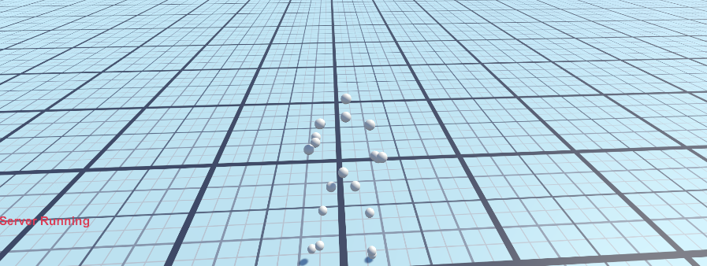
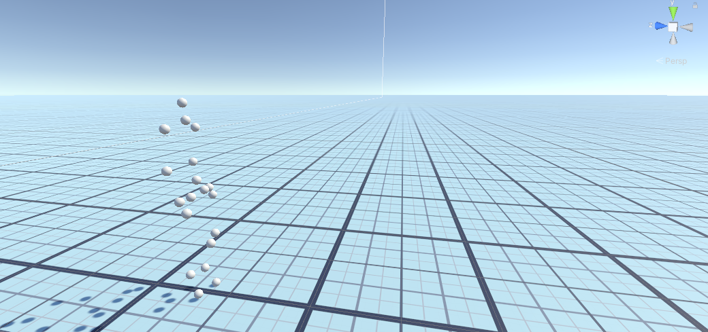

# AI Moveset


A unity Extenstion to help integrate RNN synthesized Humaniod animations into yourgames.





## Environment Setup
### Required Python Version: 3.7.16
#### Install the following packages into your python installation

  ```bash
pip install tensorflow==1.14.0
pip install fastapi
pip install uvicorn
```

### Required Unity Editor:  2021.3.16f1
#### You can download it from here:
```bash
https://unity.com/releases/editor/whats-new/2021.3.16
```
### Steps for installation:

```bash
1. Download or clone this repository.
2. Place the folder "AI_Moveset_Extension" alongside your unity proejects.
3. Goto Unity Hub and click on: "Open > Add project from disk."
4. Launch the Project and Start your development.
```
